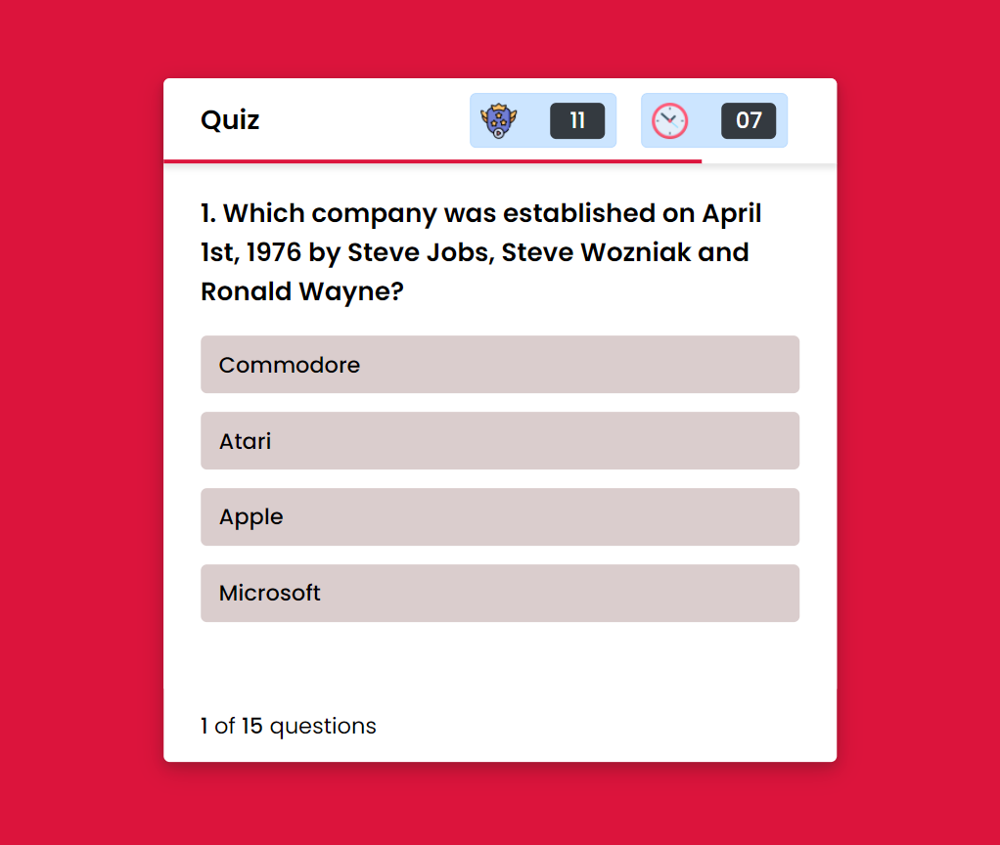

# Quiz Application

## Introduction
In this project I have developed a quiz application which is completely built using html, css and javascript. Several categories are available, and questions will only be displayed according to the categories you have selected. There are a total of 15 questions and after every 5 questions the difficulty level will be increased and the time will also be increased by 15 seconds. After completing the quiz, the result will be displayed.

## 📷 Screenshort


## ✨ Features
1. Question will be asked according to selected categories.
2. After every 5 questions, difficuulty level will be increased also the time by increased by 15 secs.
3. Highscore will be displayed corresponding to the timer.
4. User friendly and responsive to every device.
5. If the correct answers are greater than 5, confetti will be displayed.

## API Reference-

### Displaying available categories:
```http
    GET https://opentdb.com/api_category.php
```

### Displaying question:
```http
    GET https://opentdb.com/api.php?amount=30&category=26&difficulty=medium&type=multiple
```
| Parameter | Type     | Description                       |
| :-------- | :------- | :-------------------------------- |
| `amount`      | `number` | required amount of questions |
| `category`      | `number` | question according to that type |
| `difficulty`      | `string` | level of difficulty of the question |
| `type`      | `string` | which type of question(true/false or multiple) |

## 🔗 Demo
Click here to view: [link](https://varshil-shah.github.io/quiz-application/)

## About the creator:
### Varshil Shah
Feel free to mail me at my email address [Varshil Shah](mailto:varshilshah1004+github@gmail.com "Varshil Shah") for any queries.
